# Problem 1: Time-dependent evolution of a Gaussian wavepacket in 1D

## Part (a): Numerical Method

### Split operator

#### In physical units

For a lot of systems, $V(x,t) = V(x)$. Using that, the hamiltonian operator operates entirely in the realm of position. 
For these systems, we have $\psi_t = e^{-it\hat H/\hbar}\psi_0$ . This is again similar to what we got for classical Hamiltonian systems. The full derivation for this is attached in the `Notes.md` file.  

Take a look at this equation :

$$
e^{i\frac{t}{2}\hat H/\hbar}\psi_t = \psi_{t/2}= e^{-i\frac{t}{2}\hat H/\hbar}\psi_0
$$

We can approximate this for small $t$ as :

$$
(1+i\frac{t}{2}\hat H/\hbar)\psi_t \approx (1 - i\frac{t}{2}\hat H/\hbar)\psi_0 
$$

Then, for small $\Delta x$, we can discretise the $\frac{\partial^2}{\partial x^2}$ operation and write :

$$
\psi_t(x+\Delta x) + (\frac{4m\Delta x^2}{t\hbar}i - \frac{2m\Delta x^2}{\hbar^2}V(x) -2)\psi_t(x) + \psi_t(x-\Delta x) \\ \approx \\
- \psi_0(x+\Delta x) + (\frac{4m\Delta x^2}{t\hbar}i + \frac{2m\Delta x^2}{\hbar^2}V(x) + 2)\psi_0(x) - \psi_0(x-\Delta x)
$$

Define 

$$
a(x) = \frac{4m\Delta x^2}{t\hbar}i - \frac{2m\Delta x^2}{\hbar^2}V(x) -2 \\
b(x) = \frac{4m\Delta x^2}{t\hbar}i + \frac{2m\Delta x^2}{\hbar^2}V(x) + 2
$$

Then, we can write :

$$
\begin{bmatrix}1 & a(x) & 1\end{bmatrix} \begin{bmatrix}\psi_t(x+\Delta x) \\ \psi_t(x) \\ \psi_t(x-\Delta x)\end{bmatrix} =
\begin{bmatrix}-1 & b(x) & -1\end{bmatrix} \begin{bmatrix}\psi_0(x+\Delta x) \\ \psi_0(x) \\ \psi_0(x-\Delta x)\end{bmatrix}
$$

From here, you can write the equation for the whole grid/segment using tridiagonal matrices $A,B$ as :

$$
A \vec \psi_t = B \vec \psi_0
$$

And then solve this using tridiagonal matrix solvers from `scipy` that can solve this in $O(N)$.

#### Atomic Units

For a single electron in first shell of hydrogen atom, we define:

$$
\alpha = \frac{1}{4\pi \epsilon_0}\frac{q_e^2}{\hbar c} \approx \frac{1}{137}\quad \text{ and} \quad V_1 = \frac{q_e^2}{4\pi \epsilon_0}\\
a_0 = \frac{\hbar^2}{m_eV_1}= \frac{4\pi \epsilon_0 \hbar^2}{m_e q_e^2} = \frac{\hbar}{\alpha m_e c} = 0.529\times 10^{-10} \text{ m} \\
E_0 = -V_0 = \frac{V_1}{a_0}= \frac{q_e^4 m_e}{(4\pi\epsilon_0)^2 \hbar^2} = \alpha^2m_ec^2 = 27.2 \text{eV}
$$

With these constants, we make these substitutions in the TDSE :

$$
x = \tilde x a_0 \\
V = \tilde V E_0 \\
t = \tilde t \hbar/E_0
$$

This gives us the A-dimensional Time Dependent Schrodinger Equation (ATDSE) :

$$
\boxed{
-\frac{1}{2}\frac{\partial^2 \psi}{\partial \tilde x^2} + \tilde V \psi = \tilde H \psi = i \frac{\partial \psi}{\partial \tilde t}
}
$$

Here $\tilde H = \frac{1}{E_0} \hat H = -\frac{1}{2}\frac{\partial^2}{\partial \tilde x^2} + \tilde V$

Once again, assuming $\tilde V(\tilde x,\tilde t) = \tilde V(\tilde x)$, we can write :

$$
\psi_t = e^{i\hat H t/\hbar}\psi_0 = e^{i \tilde H \tilde t }\psi_0
$$

The split operator approximation was:

$$
\psi_t(x+\Delta x) + (\frac{4m\Delta x^2}{t\hbar}i - \frac{2m\Delta x^2}{\hbar^2}V(x) -2)\psi_t(x) + \psi_t(x-\Delta x) \\ \approx \\
- \psi_0(x+\Delta x) + (\frac{4m\Delta x^2}{t\hbar}i + \frac{2m\Delta x^2}{\hbar^2}V(x) + 2)\psi_0(x) - \psi_0(x-\Delta x)
$$

This now becomes:

$$
\psi_{\tilde t}(\tilde x+\Delta \tilde x) + (\frac{4\Delta \tilde x^2}{\tilde t}i - 2\Delta \tilde x^2 \tilde V(\tilde x) -2)\psi_{\tilde t}(\tilde x) + \psi_{\tilde t}(\tilde x-\Delta \tilde x) \\ \approx \\
- \psi_0(\tilde x+\Delta \tilde x) + (\frac{4\Delta \tilde x^2}{\tilde t}i + 2\Delta \tilde x^2 \tilde V(\tilde x) + 2)\psi_0(\tilde x) - \psi_0(\tilde x-\Delta \tilde x)
$$

Similarly for the actual numerical method, now we define

$$
a(x) = \frac{4\Delta \tilde x^2}{\tilde  t}i - 2\Delta \tilde  x^2\tilde V(\tilde  x) -2 \\
b(x) = \frac{4\Delta \tilde x^2}{\tilde  t}i + 2\Delta \tilde  x^2\tilde V(\tilde  x) + 2
$$

Using that, we write :

$$
\begin{bmatrix}1 & a(\tilde x) & 1\end{bmatrix} \begin{bmatrix}\psi_t(\tilde  x+\Delta \tilde  x) \\ \psi_{\tilde  t}(\tilde  x) \\ \psi_{\tilde  t}(\tilde  x-\Delta \tilde  x)\end{bmatrix} \\ = \\
\begin{bmatrix}-1 & b(\tilde  x) & -1\end{bmatrix} \begin{bmatrix}\psi_0(\tilde  x+\Delta \tilde  x) \\ \psi_0(\tilde  x) \\ \psi_0(\tilde  x-\Delta \tilde x)\end{bmatrix}
$$

Using this, tri-diagonal matrices $A,B$ will be created, allowing us to do the implicit split-operator step by solving $A\psi_{\tilde t} = B \psi_0$ in $O(N)$ operations using `scipy`.

For further accuracy, we can even go to a penta-diagonal matrix, using 5-point evaluation of the $\frac{\partial^2}{\partial x^2}$ operator. 

### Space-Discretised Leap-Frog (SDLF)

The ATDSE is :

$$
- \frac{1}{2}\frac{\partial^2}{\partial \tilde  x^2} \psi + \tilde  V \psi= \tilde H \psi = i\frac{\partial }{\partial \tilde t}\psi
$$

Since the $\tilde H$ operator can be decomposed lineraly and maps real numbers to real numbers, we can write (after dropping the tilde) :

$$
\psi = R + iI \implies \\
H R + i H I= i \frac{\partial }{\partial t} R - \frac{\partial }{\partial t} I \implies \\
\frac{\partial}{\partial t} I  = H R \quad \text{and} \quad \frac{\partial}{\partial t} R = - H I
$$

On top of this, we have

$$
\int (I^2 + R^2) dx = 1
$$

When descritised, this equation becomes

$$
\sum_x (I_x^2 + R_x^2) = 1
$$

Similarly, the evolution equations are discretised in space as :

$$
\frac{\partial}{\partial t} I[x] = V[x]R[x] - \frac{1}{2}\frac{1}{\Delta x^2} (R[x+\Delta x]-2R[x]+R[x-\Delta x]) \\
\frac{\partial}{\partial t} R[x] = -V[x]I[x] + \frac{1}{2}\frac{1}{\Delta x^2} (I[x+\Delta x]-2I[x]+I[x-\Delta x])
$$

We can rewrite the first equation as :

$$
\frac{\partial}{\partial t} I[x] = - \frac{1}{2\Delta x^2} 
\begin{bmatrix}
1 & -2(1 + V[x]\Delta x^2) & 1
\end{bmatrix}
\begin{bmatrix}
R[x+\Delta x] \\
R[x] \\
R[x-\Delta x]
\end{bmatrix}
$$

Define $f[x] = -2(1+V[x]\Delta x^2)$ and then the tri-diagonal matrix

$$
F = \frac{1}{2\Delta x^2}\begin{bmatrix}
f[x_l] & 1 & 0 & 0 & \dots & 0 & 0  \\
1 & f[x_l + \Delta x] & 1 & 0 & \dots & 0 & 0 \\
0 & 1 & f[x_l + 2\Delta x] & 1 & \dots & 0 & 0 \\
\vdots & \vdots & \vdots & \vdots & & \vdots & \vdots \\
0 & 0 & 0  & 0 & \dots & 1 & f[x_r]
\end{bmatrix}
$$

Now, vectorising this, with $\vec R = [R_x]_x$ and $\vec I = [I_x]_x$, we can write :

$$
\frac{\partial}{\partial t}\vec R = F \vec I\\
\frac{\partial}{\partial t}\vec I = - F \vec R \\
||\vec R||^2 + ||\vec I||^2 = 1
$$

This is exactly how the hamiltonian systems we have seen evolve. The third equation is similar to the net energy being constant in a classical mechanics system.

So, just like before, we can use the position verlet LF integrator like so (for small step of size $t$):

$$
\vec R_{t/2} := \vec R_0 + \frac{t}{2} F \vec I_0 \\
\vec I_{t} := \vec I_0 - t F \vec R_{t/2} \\
\vec R_t := \vec R_{t/2} + \frac{t}{2} F\vec R_{t/2} 
$$

## Part (b): Normalization and Free Evolution

A gaussion packet with $\sigma=0.7$ centered at $x_0=-3$ was initialised and given the average initial momentum/wave-number of $k_0=2$. This was then evolved with a free potential. The evolution is visualised in the GIF animation shown. As you can see, the packet spreads in position-space as time passes, but doesn't spread in the wave-number/momentum domain. Here $\phi(k)$ is computed using FFT. The derivations and exact method can be found in `Notes.md`.  

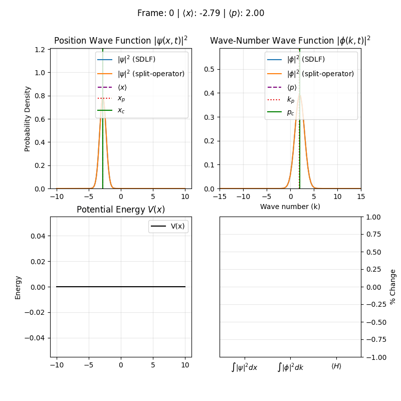

To verify that the normalisation actually happens, a plot of  $N_x(t) = \braket{\psi|\psi}$ is shown in the (static) figure, along with the normalisation $N_k$ in the momentum domain.
You can see that the variation for both $N_x$ and $N_k$ is on the order of $10^{-7}$. 

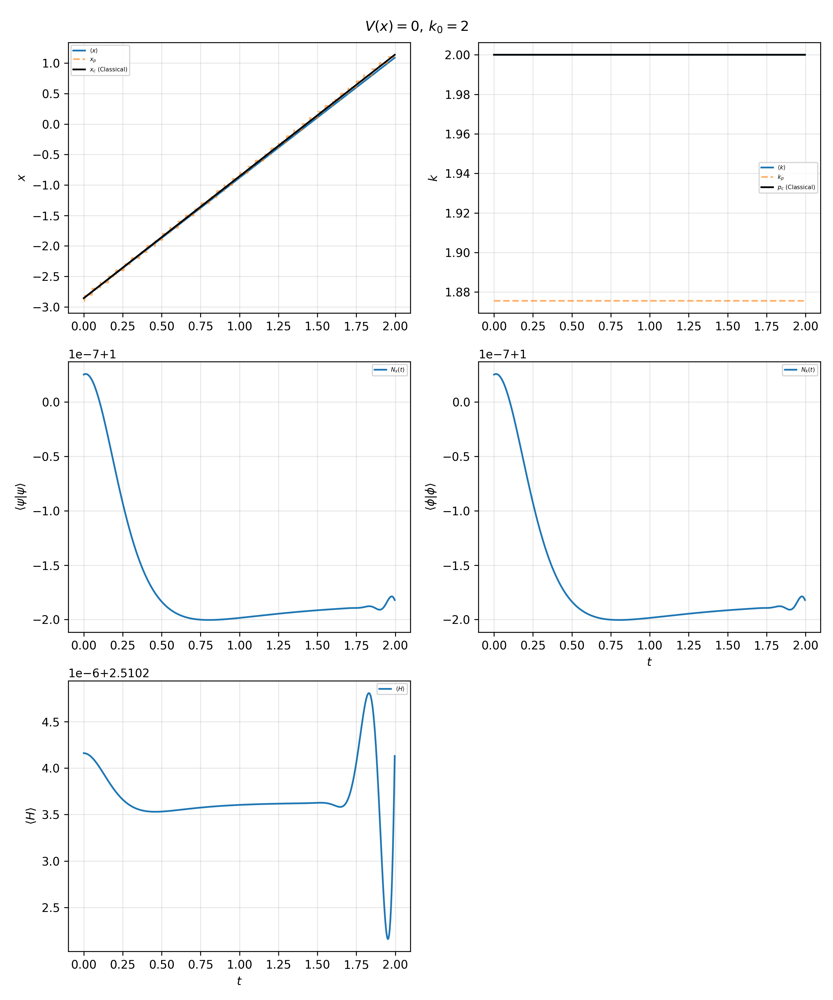

It can in-fact be proven analytically that the SDLF method preserves the discreate analogues of the $N_x$ and $N_k$ values. For the derivation, see the section "Leap-Frog like finite difference method" in `Notes.md`.

## Part (c): Harmonic Oscillator ($k_0 = 0$)

A gaussian packet with $\sigma=0.7$ was initialised at $x_0=-3$ and was given no average momentum, i.e. $k_0=0$. This was then evolved with the harmonic potential $V_0=\frac{1}{2}x^2$. You can see the periodic nature of the solution from the animation. Notice that here, the waveform in momentum space is also changing. This is because, unlike the free potential, with 0 classical force on the particle, here the classical force is $F(x) = -\frac{d}{dx}V = -2x$. You can also see vertical lines for 

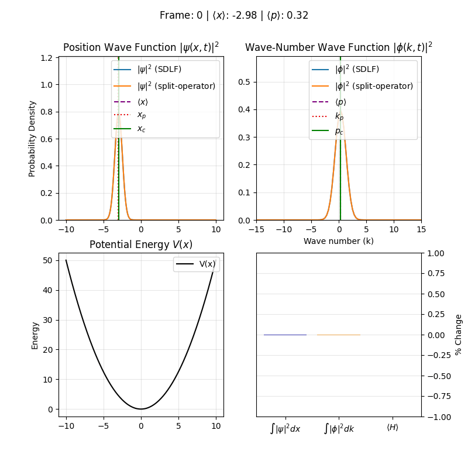

1. The most probable position $x_p(t)$ where $|\psi(x,t)|^2$ is highest
2. The mean position $\braket{x}(t)$, interpreting $|\psi|^2(x,t)$ as the probability density function. 
3. The classical solution $x_c(t)$ computed using (normal) Position-Verlet Leap-Frong integrator.

The same 3 quantities are also plotted as a function of time in a subplot of the static figure.

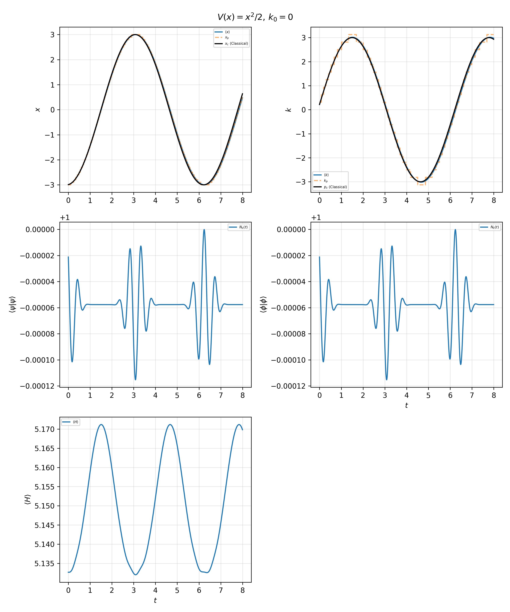

## Part (d): Harmonic Oscillator ($k_0 = 2$)

Now, the wave-packet is given an initial momentum of $k_0=2$ rather than 0. This allows it to reach further to the right, as evident from the static plot for $\braket{x}$; similar to how $x_c$ goes further to the right than before. 
You will also notice that the average energy, namely $\braket{H}(t)$ is higher (see static figure) than what it was in the case when initial momentum was 0

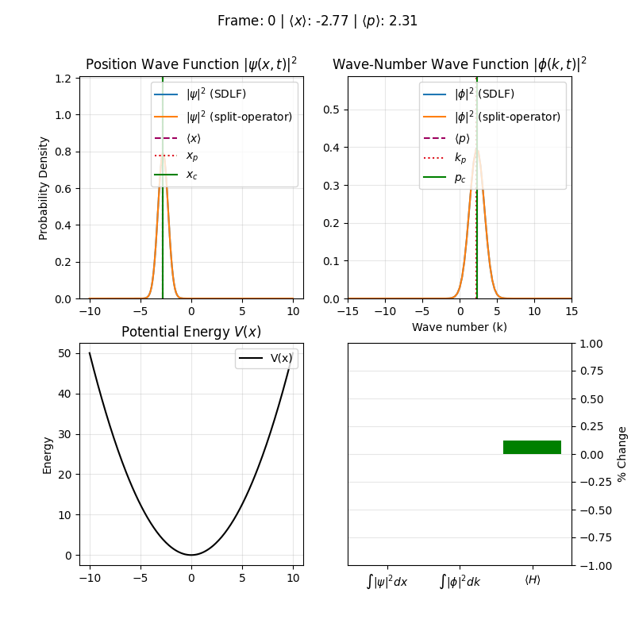
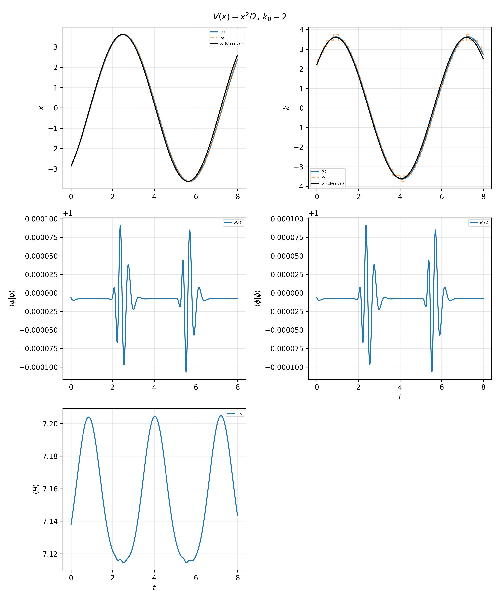

## Part (e): Numerical Stability and Accuracy

Chapter 8 for Wang's textbook says that the SDLF integrator will give stable solutions when $\Delta t < \lambda \Delta x^2$ where $\lambda$ is a characteristic of the potential $V(x)$. It states that for a free potential, we have $\lambda=1$ and that for most potentials, $\lambda=0.5$ suffices. 
In the figure, I have plotted the trajectories for position, momentum, and the variation of $N_x,N_k$ and $\braket{H}$ with time for various $\Delta x, \Delta t$ as well as for the two methods discusses.  
I initialised the wave-function as a gaussion with $\sigma=0.7$, centered at $x_0 = -3$ and with initial average momentum of $k_0 =0$. Then I evolved the packet using the harmonic potential $V(x)=x^2/2$. 

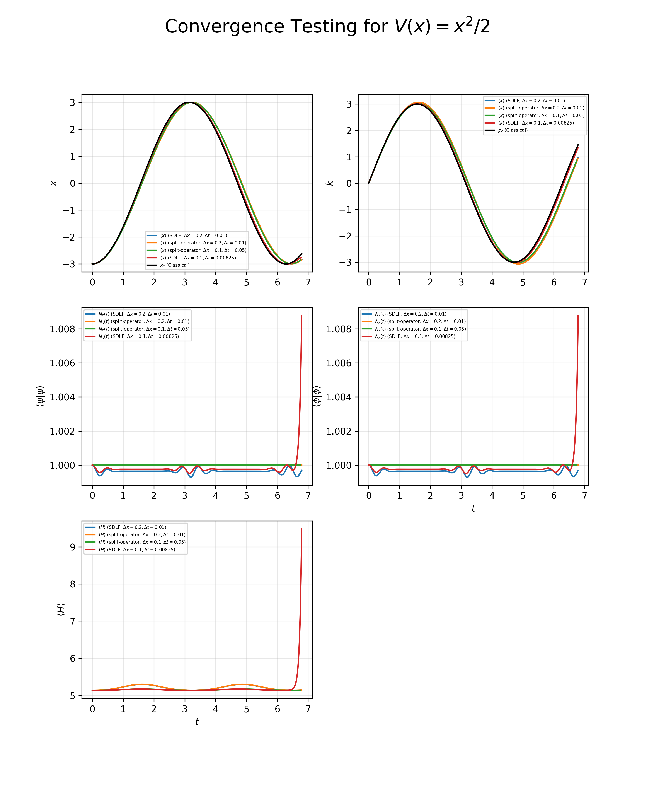

You can see that for the cases when $\Delta x=0.5$, we get slight deviations of $\braket{x}$ from the classical solution $x_c$. This is expected, since the accuracy decreases on increasing $\Delta x$. 
You can also notice that the normalisation in position space, namely $N_x(t)=\braket{\psi|\psi}$ suddenly increases by a significant amount for the case with $\Delta x=0.1$ and $\Delta t=0.00825$ when using the SDLF method. If I ran the simulation for a little longer, the numerical solution with these settings would become unstable and deviate by large amounts away from the classical solution. If you look closely, you can already see the start of this instability in the curve for $\braket{x}$.
This is because we don't have $\Delta t < \lambda \Delta x^2$ in this case. The split-operator method on the other hand, doesn't face this issue and performs well even when $\Delta t$ is 0.05 (and $\Delta x =0.1$). 
Other than that, you will notice that the SDLF solution with $\Delta x=0.1$ is the closer to $x_c$ and $p_c$ curves than the split-operator solution, simply because it has a smaller $\Delta t$ (though not small enough for numerical stability). Thus, just like always, a smaller $\Delta t$ increases accuracy. Since these methods are 2nd order, the error scales as $O(\Delta t^2)$.

## Part (f): Linear Potential

I initialised the wave-packet with the same initial position and spread as all other parts, and 0 initial momentum. Then, I let it evolve under $V(x)=Fx =x$ for a longer duration so that it hits the boundary. This was done intentionally to observe the effects of the boundary. 

Since we assumed $\psi =0$ at the boundary at all times, we have effectively assumed that $V=\infty$ outside the grid/segment we are solving for. This makes the boundaries perfectly reflective, with no part of the wavefunction being transmitted forward, and all probability mass reflected backwards.
So, a wave moving towards left is reflected back. This reflected wave then interferes with the part of the original wave that is not yet reflected, giving us a wavy interference pattern. This can be seen towards the end of the animation. 

Before the particle gets close to the boundary, it has constant acceleration and thus follows the equation $\braket{x} \approx x_c = -3 -\frac{1}{2}Ft^2 = -3 -t^2/2$. This is a downward facing parabola, as evident from the subplot for position in the static figure. Note that even now, there is some effect from the boundary, but it isn't large enough for it to be visible.
Another thing to note is that the average momentum also changes linearly, similar to the the classical solution.
The wave-packet also spreads in position with time (see GIF animation), similar to what we saw in the case for the free particle. 

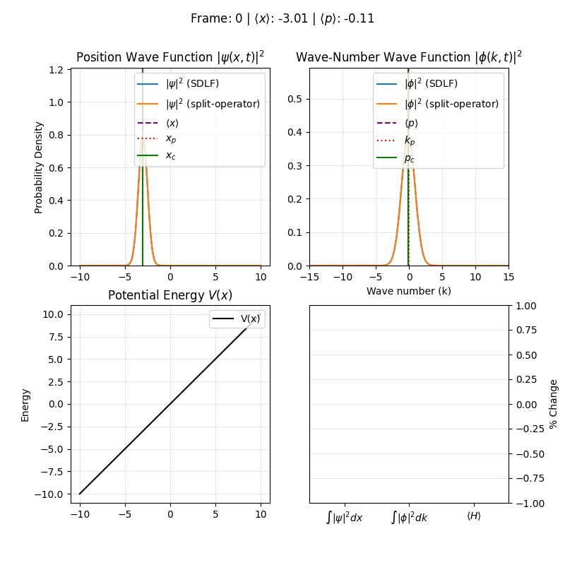

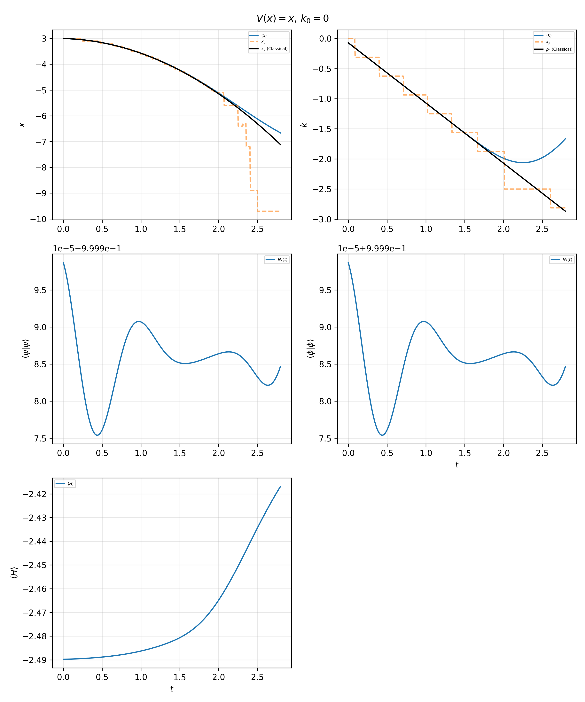

# Problem 2: Radial Schrodinger equation for the hydrogen atom

## Part (a): Effective Potential

Consider the 3D ATDSE with a central attractive potential $V(r)$ where $r = |r|$:

$$
-\frac{1}{2}\nabla^2\psi(\vec r, t) + V(r)\psi(\vec r,t) = i\frac{\partial }{\partial t}\psi(\vec r, t)
$$

We can, as always, convert this to a time-independent equation as :

$$
-\frac{1}{2}\nabla^2\psi(\vec r) + V(r)\psi(\vec r) = E\psi(\vec r)
$$

Now, futher doing a separation of variables as $\psi(\vec r) = R(r)Y(\alpha, \beta)$ (where $\alpha$ is the angle from the z axes and $\beta$ is the polar angle in the x-y plane) and using the spherical coordinate version of the laplacian, i.e.

$$
\nabla^2 = \frac{1}{r^2}\frac{\partial}{\partial r} r^2 \frac{\partial}{\partial r}
+ \frac{1}{r^2}\frac{1}{\sin \alpha}\frac{\partial}{\partial \alpha} \sin \alpha \frac{\partial}{\partial \alpha}
+ \frac{1}{r^2}\frac{1}{\sin^2 \alpha}\frac{\partial^2}{\partial \beta^2}
$$

we can write :

$$
\nabla^2 \psi(\vec r) = 
[\frac{1}{r^2} \frac{\partial }{\partial r} r^2 \frac{\partial}{\partial r} R]Y 
+ [\frac{1}{r^2}R][\frac{1}{\sin \alpha}\frac{\partial}{\partial \alpha} \sin \alpha \frac{\partial}{\partial \alpha} Y 
+ \frac{1}{\sin^2 \alpha}\frac{\partial^2}{\partial \beta^2} Y] 
= 2(V(r)-E)RY
$$

For the cases where $\psi \ne 0, r \ne 0$, we can write :

$$
[\frac{1}{R} \frac{\partial }{\partial r} r^2 \frac{\partial}{\partial r} R] 
+ [\frac{1}{Y}\frac{1}{\sin \alpha}\frac{\partial}{\partial \alpha} \sin \alpha \frac{\partial}{\partial \alpha} Y 
+ \frac{1}{Y}\frac{1}{\sin^2 \alpha}\frac{\partial^2}{\partial \beta^2} Y] = 2r^2(V(r)-E) \\ \implies \\
\frac{1}{Y}\frac{1}{\sin \alpha}\frac{\partial}{\partial \alpha} \sin \alpha \frac{\partial}{\partial \alpha} Y 
+ \frac{1}{Y}\frac{1}{\sin^2 \alpha}\frac{\partial^2}{\partial \beta^2} Y 
= 2r^2(V(r)-E) 
- \frac{1}{R} \frac{\partial }{\partial r} r^2 \frac{\partial}{\partial r} R
$$

Clearly, since LHS and RHS are functions of different coordinates, they must both be a constant, say some $L$. This gives :

$$
LR = 2r^2R(V-E) - \frac{d}{dr}r^2 \frac{d}{dr}R \\
LY\sin^2\alpha = \sin\alpha \frac{\partial}{\partial \alpha} \sin\alpha \frac{\partial}{\partial \alpha} Y + \frac{\partial^2}{\partial \beta^2}Y
$$

Now, as we have arbitrary scaling for each part, we can WLOG assume that the angular part is normalised. 
Essentially, we require :

$$
\int_{r=-\infty}^\infty\int_\alpha\int_\beta R(r)^2Y^2(\alpha,\beta) r^2\sin\alpha dr d\alpha d\beta = 1 \\\implies
[\int_{-\infty}^\infty R^2(r)r^2 dr][\int_{\alpha}\int_\beta Y^2(\alpha,\beta) \sin\alpha d\alpha d\beta] =1
$$

By ensuring that

$$
\int_{\alpha}\int_\beta Y^2(\alpha,\beta) \sin\alpha d\alpha d\beta =1
$$

we can then have the normalisation

$$
\int_{-\infty}^\infty R^2(r)r^2 dr =1
$$

We can, in fact solve for $Y$ entirely without knowing what $V$ is. The solution has basis functions of form $Y_{m,l}$ where $m,l$ are integers. These are called the the azimuthal quantum number and the angular momentum quantum number. This derivation is carried out in detail in `Notes.md`. But since we are only interested in the radial part, the only thing that we take from the results of that derivation is $L - l(l+1)$. 

Now, substituting $L = -l(l+1)$ back into the equation for $R$, we get :

$$
-l(l+1)R = 2r^2R(V-E) - \frac{d}{dr}r^2 \frac{d}{dr}R
$$

Define $u(r)=rR(r) \implies R = u/r$, giving us :

$$
-l(l+1)\frac{u}{r} = 2ru(V-E) - \frac{d}{dr} (ru' -u) \\\implies
-l(l+1)u = 2r^2u(V-E) - r (ru'' + u' - u') \\\implies
\boxed{u''(r) = (2(V(r)-E) +\frac{l(l+1)}{r^2}) \,u(r)}
$$

This is accompanied by the normalisation condition

$$
\int_{-\infty}^\infty u^2(r)dr = 1
$$

and the expectation equation (assuming normalisation is done) :

$$
\braket{g(r)} = \int_{-\infty}^\infty g(r)u^2(r)dr
$$

Now, consider the a-dimensionalised electrostratic potential for an electron in some shell of a hydrogen atom, i.e. $V(r) = -1/r$. Plugging that in, we get :

$$
u''(r) = (-2E - \frac{2}{r} + \frac{l(l+1)}{r^2}) u(r) \iff\\
\boxed{-\frac{1}{2} \frac{d^2}{dr^2} u(r) + [\frac{l(l+1)}{2r^2} - \frac{1}{r}]u(r) = Eu(r)}
$$

The boxed equation is what the assignment refers to as the "radial equation" (though it's using $u = rR$ and not $R$).

Define 

$$
V_\text{eff}(r) = V(r) +  \frac{l(l+1)}{2r^2}
$$

This can be interpreted as the **potential in a rotating reference frame with angular momentum of $\sqrt{l(l+1)}$**. We had the same thing during planetary motion. 

For the electrostatic potential of hydrogen, we have :

$$
V_\text{eff}(r) = -\frac{1}{r} +  \frac{l(l+1)}{2r^2}
$$

This function is plotted for several different values of $l$ in the figure.

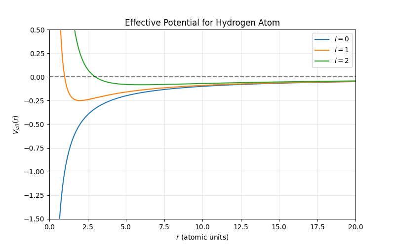

Using this, we can rewrite the equation as :

$$
u''(r) = 2(V(r)-E) u(r) \iff \\
-\frac{1}{2}\frac{d^2}{dr^2} u(r) + V_\text{eff} u(r) = E u(r)
$$

This is similar to the usual TISE formulation, although $u(r)$ is not really the wave function we want to finally be solving for. 
And again, similar to planetary motion, we can have bound states if $E < V_\text{eff}$, meaning that the particle that the wavefunction represents is (classically) trapped in a potential well. However, note that the shape of the wavefunction (given by $|\psi|^2$) doesn't change at all with time. The condition that $E < V_\text{eff}$ is for the equation to have a physical solution.

Since the assignment asks to modify the potential in one of the parts, let us consider a more general potential of 

$$
V(r) = -\frac{Ze^{-\mu r}}{r} + \lambda r^2 \\\implies
V_\text{eff}(r) = -\frac{Ze^{-\mu r}}{r} + \lambda r^2 + \frac{l(l+1)}{2r^2}
$$

This is what we will use for the implementation. Namely, we will have the function:

```python
def electrostatic_potential_eff(r:(np.ndarray|float), l=0, mu=0, lamb=0, Z=1):
    return (lamb*r*r) + (l*(l+1)/(2*r*r)) - (Z*np.exp(-mu*r)/r)
```

## Part (b),(c),(d) : Shooting method and Bound-State Energies

### Theory and design

In general, the (1D) ATISE has 2 _mathematical_ basis solutions for any $E < 0$; one physical (like we saw) and other _non-physical_ which _grows_ exponentially on the tails.

Define $x_m = \frac{1}{2}(x_r + x_l)$.
Then, one can get a mathematically unique solution for $[x_m, \infty)$ by setting $u_E(x_r)=0$ and $u_E'(x_r)=v_r$. This will be a linear combination of the physical solution that decays to 0 as $x\to \infty$ and the non-phyiscal solution that explodes $\infty$ instead. Now, by setting $v_r$ as a very small value, the coefficient for the non-physical solution will be small (assuming $x_r$ is large enough) and thus the contribution of the non-physical solution at $x_m$ will be small. 
This means, that we will effectively recover the value of the _physical_ solution as $x_m$. The same goes for the derivative $u_E'$ too (the non-physical solution's contribution to the derivative will be small at $x_m$). 
Similarly, if we solve for $(-\infty, x_m]$, with $u_E(x_l)=0$ and $u_E'(x_l)=v_l$, the non-physical solution (which explodes to $\pm \infty$ as $x\to \infty$) will have very small contributions at $x_m$ . 

Furthermore, the exact values of $v_l$ and $v_r$ only scale the (non-normalised) solutions $u_E ^\uparrow, u_E^\downarrow$ for $(-\infty, x_m]$ and $[x_m, \infty)$ respectively. We know that for the correct values of $v_r$ and $v_l$, the physical solutions for the two halfs will become identical. Again, since this is a 2nd order ODE, this is equivalent to saying 

$$
u_E^\uparrow(x_m) = u_E^\downarrow(x_m) \\
u_E'^\uparrow(x_m) = u_E'^\downarrow(x_m)
$$

But even without the correct ratio of $v_r, v_l$, what we _do_ have is :

$$
\exist\, C \in \mathbb{R} \;\text{ s.t.} \quad
u_E^\uparrow(x_m) = C u_E^\downarrow(x_m) \quad
\text{and} \quad u_E'^\uparrow(x_m) = C u_E'^\downarrow(x_m) \\\implies
f(E) := u_E^\uparrow(x_m) u_E'^\downarrow(x_m) - u_E^\downarrow(x_m)u_E'^\uparrow(x_m) = 0
$$

Of course, for an $E$ that is not an eigen-energy, we will have $f(E)\ne 0$.
As it turns out, this matching loss $f(E)$ is actually the Wronskian of the two solutions ($u_E^\uparrow, u_E^\downarrow$). This is exactly 0, only when the two solutions (after normalisation) are the same (save for a sign change). Moreover it is not dependent on the matching point (which is the mid-point $x_m$ in our case).

This is the basis for the shooting method. 
We choose extreme $x_l, x_r$ values (as per the spatial scale of the problem) and discretise the $[x_l, x_m]$ and $[x_m, x_r]$ segments. We set the boundary conditions for $x_l, x_r$ as described, with arbitrary, but small values of $v_l, v_r$ and solve the 2nd order ODE, for a given energy $E<0$ for the $[x_l, x_m]$ segment and $[x_m, x_r]$ segment individually (with the 2nd segment solved backwards from $x_r$ to $x_m$) to get the value of $u_E^\uparrow(x_m),u_E'^\downarrow(x_m),u_E^\downarrow(x_m),u_E'^\uparrow(x_m)$ and thus $f(E)$. Solving the 2nd order ODE can be done using any method, say RK2; but since the integration often passes through a region containing the "classical turning (inflection) point" and can be over-whelmed by (auto-regressive) noise due to numerical errors, an integrator with superior accuracy (such as Numerov's method) is preffered. 
The goal is to verify whether $E$ is an eigen-energy by checking whether $f(E)\approx 0$.

Although, we can zero-in on a particular eigen-energy using bisection methods in $\log_2(N_E)$ time were $N_E$ is the number of values of $E$ (regularly spaced) that we will test. I instead want to create plots for $f(E)$ itself. To do this, I will define:

$$
\vec u(x) = [u_{E_k}(x)]_k \\
\vec v(x) = [u'_{E_k}(x)]_k \\
\vec E = [E_k]_k
$$

and re-write the ATISE as :

$$
\frac{d}{dx} \vec v(x) = 2(V(x)-\vec E)* \vec u(x) = \vec{K(x)}*\vec u(x) = \vec a(x)\\
\frac{d}{dx} \vec u(x) = v(x)
$$

Here, the "$*$" symbol represents point-wise multiplication. 

Now, it's worth noting that since we cannot integrate over $r=0$ (since there is a singularity for $V_\text{eff}$), our interval $[r_l, r_r]$ must lie in the $r>0$ region entirely. This is different from the assumptions we made while developing the Shooting method. In particular, we assumed that $x_l, x_r$ are extreme values, for which the physical solution will have small value and derivative, while the non-physical solution will have values with large magnitudes. Here, though $r_l$ is not _extreme_, it still has the property we need, namely that the physical solution for $u(r)=rR(r)$ will have a small value (though $R(r)$ may not have small values) and the non-physical solution, which has the asymptotics of $r^{-l}$ will have a large values.

### Results

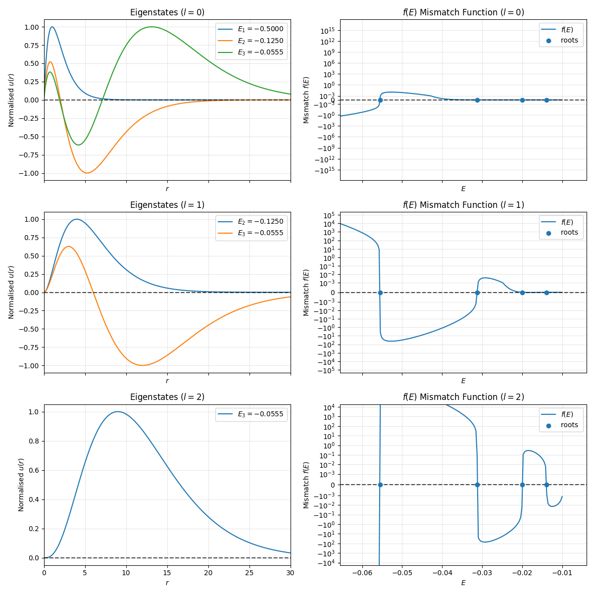

In the right-side of the figure, you can see the plots for $f(E)$ for different values of $l$. Using these, the eigen-energies were identified.
For these eigen-energies (and corresponding values of $l$), the eigen-states were computed by numerically solving the radial wave equation in $u(r)$. These are plotted to the left side in the figure. The corresponding energies are shown in the figure too. For each energy, the principal quantum number $n$ (in the subscript; e.g. $E_2$) was computed using this function :

```python
def E2n(E):return int(round((-2*E)**-0.5))
```

This is because the energy is given by $E_n = -\frac{1}{2n^2}$. The same can be verified from the numbers reported in the labels of the figure. The theoretical values are $E_1 = -0.5$, $E_2 = -0.125$, $E_3=-1/18=-0.05555{\large \bar 5}$

You can also manually count the number of nodes for each eigenstate as the number of times that curve for $u(r)$ cuts the x-axis (except at $r=0$). As you can easily verify from the plots, this number is always exactly $n-l-1$. For example in the top-left subplot (for the $l=0$ case, i.e. s orbitals), when $n=1$ (blue curve), we have no points (other than $r=0$) where the curve crosses the x-axis. For $n=2$ (2s orbital, orange curve), it happens once, very roughly at $r\approx 2$. For $n=3$, it happens twice, first around 2 and then around 7. Similarly for the $l=1$ case, the $n=3$ curve (orange) cuts the x-axis $n-l-1 = 1$ times (around $r=6$) and the $n=2$ curve doesn't cut. Notice that there is no curve for $n=1$, since we don't have a physical solution for the resultant $E-V_\text{eff}$.

You can also notice that the energies for the 3s ($E_3,\, l=0$),3p ($E_3,\, l=1$), and 3d ($E_3,\, l=2$) states are all the same ($-0.05\bar 5$). Similarly, those for 2s and 2p states are the same (-0.125). 
Thus, there is a degeneracy in the energy levels, i.e. for the same eigen-energy, you can have multiple values of $l$. 

## Part (f): Degeneracy Breaking

Since $E_n = -\frac{1}{2n^2}$, thus the different $V_\text{eff}$ functions for different $l$ values, all give us the same energy levels. This is something that only happens for the Coulumbic potential $V(r)=-Z/r$. To demonstrate this fact, we will use the generalised modified-effective-potential mentioned earlier and numerically solve for the eigen-energies using the shooting method for cases where $\mu\ne 0$ or $\lambda\ne 0$. The resultant plots for $f(E)$ and eigenstates are shown in the figure. To ensure each energy level can be mapped to an energy level for the unmodified case, but we can still notice loss in degeneracy, I have chosed $\mu=10^{-2}$ and $\lambda=10^{-5}$ for this analysis. 

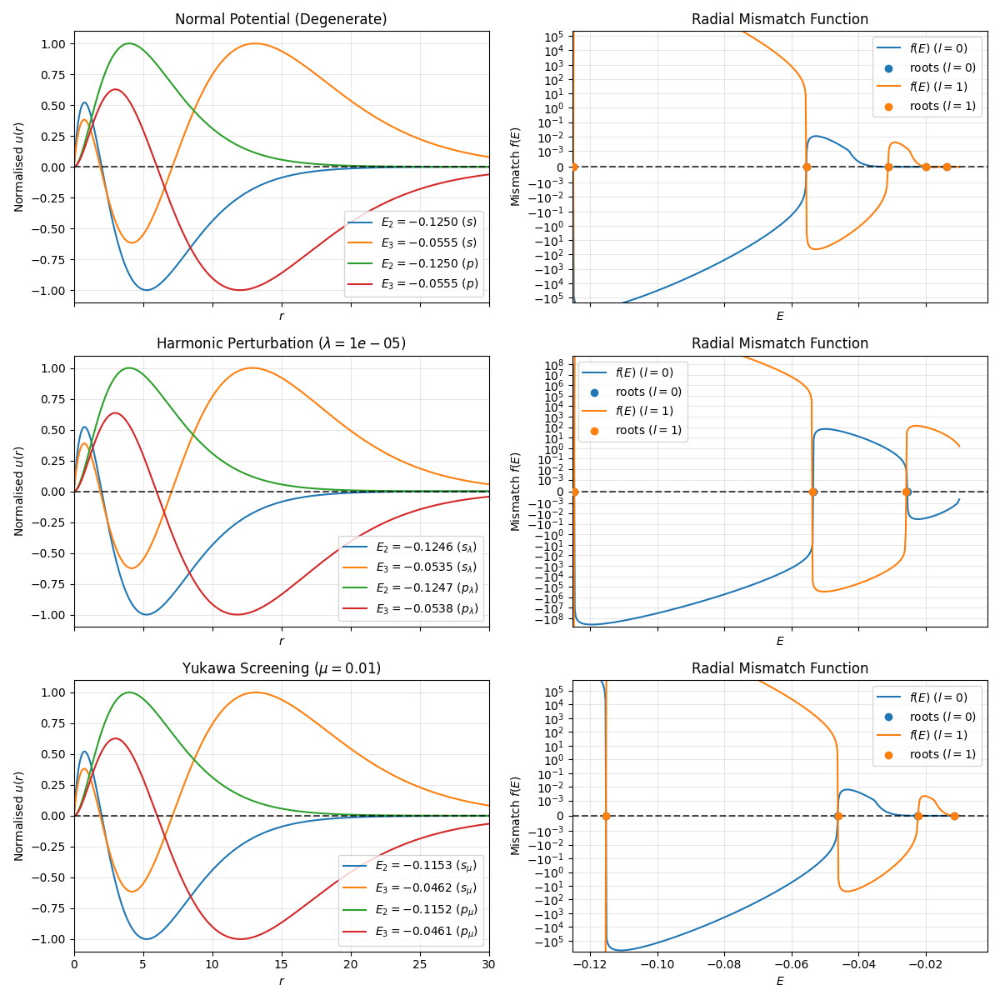

For a more accurate analysis, the differences in the energy levels closest to 2s and 2p states (for the $l=0$ and $l=1$ case) were computed. These were the results :

* Normal : $|E_{2s} - E_{2p}| \approx 3.14\times 10^{-7}$
* $\lambda$ = 1e-05 :		$|E_{2s} - E_{2p}| \approx 1.18\times 10^{-4}$
* $\mu$ = 0.01$ :		$|E_{2s} - E_{2p}| \approx 4.94\times 10^{-5}$

As you can see, there is significantly more difference between the energy levels of these states when the potential is modified. This is even clearer when $n=3$ is considered (see figure for the energy values).
The little bit of difference between the energy states fir the un-modified potential is due to small numerical errors and can be considered noise. 

## Part (g) : $\braket{r}$ and $\braket{1/r}$

Forcing the normalisation condition

$$
\int_{-\infty}^\infty u^2(r)dr = 1
$$

we get the expectation equation :

$$
\braket{g(r)} = \int_{-\infty}^\infty g(r)u^2(r)dr
$$

Or effectively, without forcing any normalisation, we have :

$$
\braket{g(r)} = \frac{\int_{-\infty}^\infty g(r)u^2(r)dr}{\int_{-\infty}^\infty u^2(r)dr}
$$

After obtaining the numerical solution for $u(r)$, we can easily estimate $\braket{g(r)}$ for any $g$ that has the property that $u^2(r)g(r) \to 0$ as $r\to 0$ and as $r\to \infty$. As it turns out, the function $g(r)=r$ and $g(r)=1/r$ have this property.
Note that for $\braket{1/r}$, since $g(r)=1/r \to 0$ as $r\to \infty$, ignoring the integration for the $[r_r, \infty)$ part doesn't cause major error. But ignoring the integration in the region $(0,r_l]$ does cause some errors, though not enough to completely throw off the estimate.
Thus, numerically integrating $ru^2$ and $\frac{1}{r}u^2 = rR^2$ over the $[x_l, x_r]$ region, we get these values :

| State | $\braket{r}$ | $\braket{1/r}$ |
| ----- | ------------- | -------------- |
| 1s    | 1.50785   | 0.99220 |        
| 2s    | 6.02084   | 0.24870 |        
| 2p    | 4.99987   | 0.25001 |        
| 3s    | 13.53564  | 0.11067 |        
| 3p    | 12.49742  | 0.11114 |        
| 3d    | 10.49810  | 0.11113 |        

These are close to the theoretical values of:

$$
\braket{r} = \frac{1}{2}[3n^2 - l(l+1)] \\
\braket{1/r} = 1/n^2
$$

Using these formulae, the same table would be populated as :

| State | $\braket{r}$ | $\braket{1/r}$ |
| ----- | ------------- | -------------- |
| 1s | 1.50000  | 1.00000 |
| 2s | 6.00000  | 0.25000 |
| 2p | 5.00000  | 0.25000 |
| 3s | 13.50000 | 0.11111 |
| 3p | 12.50000 | 0.11111 |
| 3d | 10.50000 | 0.11111 |

# Problem 3: 2D Quantum Scattering

## Part (a) : Numerical method

We can extend the split operator method to 2D by assuming $\Delta y = \Delta x$ and defining 

$$
a(x,y) = \frac{4m\Delta  x^2}{t\hbar}i - \frac{2m\Delta  x^2}{\hbar^2}V(x,y) -4 \\
b(x,y) = \frac{4m\Delta x^2}{t\hbar}i + \frac{2m\Delta x^2}{\hbar^2}V(x,y) + 4
$$

and writing

$$
\begin{bmatrix}
0 & 1 & 0 \\
1 & a(x) & 1 \\
0 & 1 & 0
\end{bmatrix} 
\circ
\begin{bmatrix}
\psi_t(x+\Delta x,y+\Delta y) & \psi_t(x,y+\Delta y) & \psi_t(x-\Delta x,y+\Delta y) \\
\psi_t(x+\Delta x,y) & \psi_t(x,y) & \psi_t(x-\Delta x,y) \\
\psi_t(x+\Delta x,y-\Delta y) & \psi_t(x,y-\Delta y) & \psi_t(x-\Delta x,y-\Delta y) \\
\end{bmatrix} \\
= \\
\begin{bmatrix}
0 & -1 & 0 \\
-1 & b(x) & -1 \\
0 & -1 & 0
\end{bmatrix} 
\circ
\begin{bmatrix}
\psi_0(x+\Delta x,y+\Delta y) & \psi_0(x,y+\Delta y) & \psi_0(x-\Delta x,y+\Delta y) \\
\psi_0(x+\Delta x,y) & \psi_0(x,y) & \psi_0(x-\Delta x,y) \\
\psi_0(x+\Delta x,y-\Delta y) & \psi_0(x,y-\Delta y) & \psi_0(x-\Delta x,y-\Delta y) \\
\end{bmatrix} 
$$

Solving this is going to be a nightmare.

So instead, we approximate even more, giving us what is known as the _Alternat Direction Implicit_ method. 

Here, we split the hamiltonian operator as $\hat H = \hat H_x + \hat H_y$ where 

$$
\hat H_x = -\frac{\hbar^2 \hat p_x^2}{2m} + V_x(x,y) \\
\hat H_y = -\frac{\hbar^2 \hat p_y^2}{2m} + V_y(x,y)
$$

It it's possible to separate the potential as $V(x,y) = V_x(x) + V_y(y)$, we can simply split it. Otherwise, we can do $V_x = V_y = V/2$

Now, for the method, we discretise the wave-function over a grid, giving us the matrix $\Psi[y,x]$. Just like before, we create the tri-diagonal matrices (using $t/2$ rather than $t$), but now for each dimension separately. Then we solve :

$$
A_{x}(y)\Psi_{t/2}[y] = B_x(y)\Psi_0[y]
$$

for all $y$ and then

$$
A_y(x)\Psi_{t}^T[x] = B_y(x)\Psi_{t/2}^T[x]
$$

for all $x$.

This effectively takes $O(MN)$ operations each iteration, assuming the grid is $M\times N$ points big.

Note that this analysis was done for the physical 2D TDSE, which is :

$$
-\frac{\hbar^2}{2m}\nabla^2 \psi + V \psi = i\hbar \frac{\partial}{\partial t}\psi 
$$

The $A_x(y)$ and $B_y(x)$ need to be translated to the adimensional versions (as done in `CQM.py`) for implementation. 

As suggested in the assignment, the grid will have $x,y \in [-20,20]$ and $\Delta y = \Delta x = 0.1$. We will have $\Delta t = 0.003$ for all the animations created (and the respective plots).

## Part (a): Boundary Conditions and Normalization

Similar to the 1D case, we use perfectly reflecting boundaries that have $\psi=0$ at all times. 
For normalisation, we will ensure that

$$
N_{\vec x}(t) = \braket{\psi_t | \psi_t} \approx \Delta x^2\sum_x\sum_y \psi_t[x,y] = 1 + \epsilon_t
$$

where $\epsilon_t$, the error, is a small quantity, arising from rounding and discretization errors. 
Just like before, we will plot $N_{\vec x}(t)$ as a function of time/step. 
We will also compute the 2D FFT of $\psi_t$, giving the momentum wave-function $\phi_t$ and its norm $N_{\vec p}(t) = \braket{\phi_t| \phi_t}$.

As suggested in the assignment, the wave-packet will be centered at $(-8,0)$ and have an initial momentum $k_x$ to the right (with $k_y=0$). The wave-packet will be gaussian and have the spread of $\sigma=1$ in either direction, which is much smaller than the grid's dimensions and will prevent the boundary affecting the simulation.  

## Part (b): Free Propagation

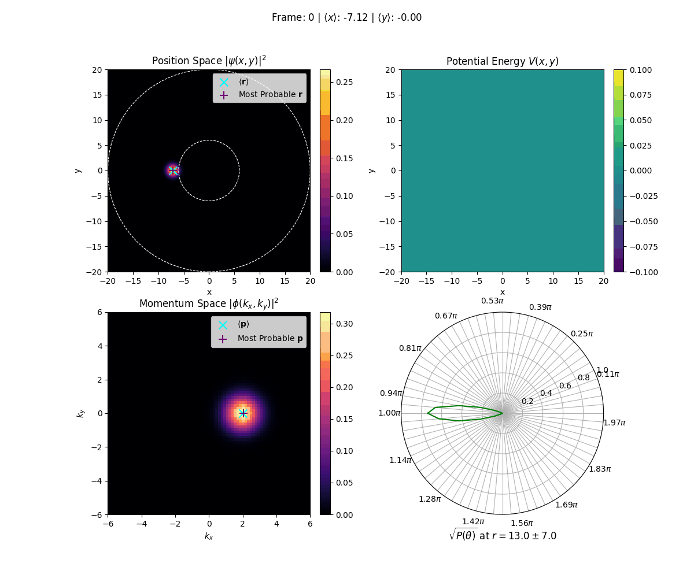

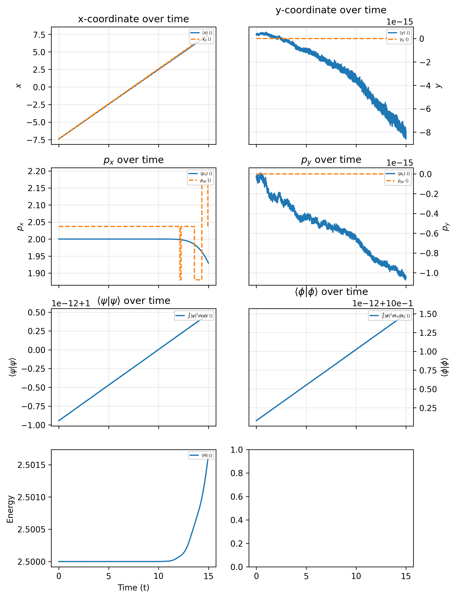

Once again, as you can see, towards the end of the simulation, the momentum in $x$ directon starts to change (invert, more specifically). This is due to the reflection of the wave-packet by the right boundary of the grid.

Also notice how the norm $\braket{\psi|\psi}$ stays close to 1, with variation being on the order of $10^{-12}$

## Part (c) and (f): Repulsive Barrier and classical shadow region


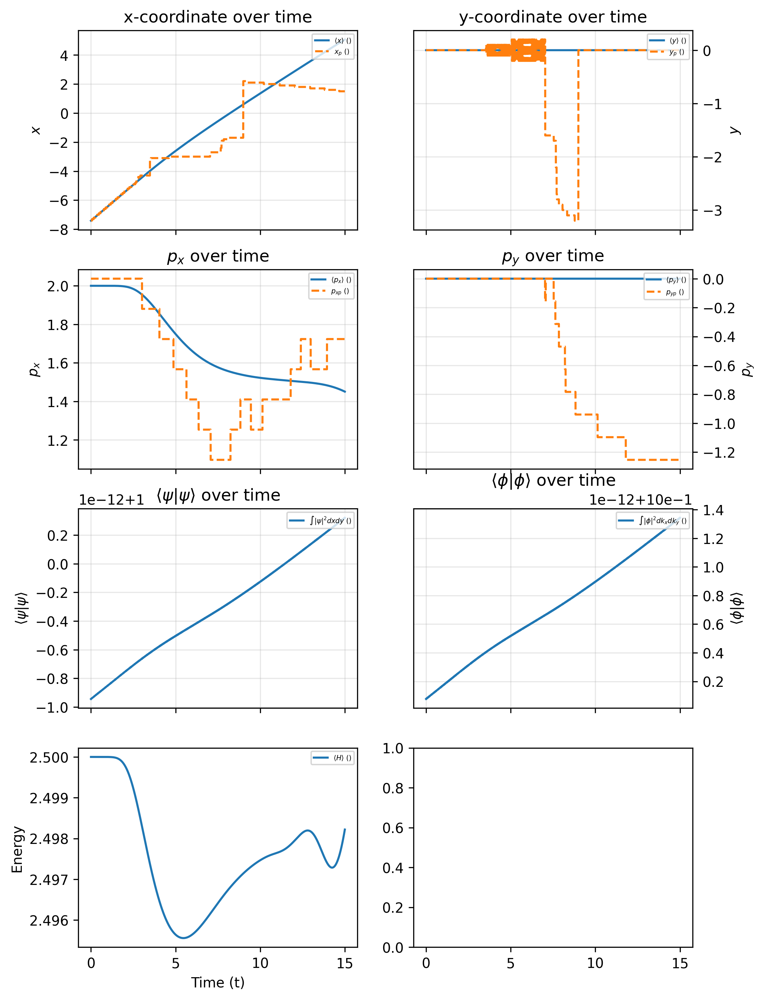

You can see in the animation that after the wave-packet encounters the repulsive disk potential, there is a wavefront (a little after the first thin reflection) travelling to the left. This is the reflected wave. 
Notice that there is some of the incident probability mass that actually goes inside and beyond the disk, i.e. in the region where $x>R=3$ and $y\in [-R/2,R/2] = [-1.5, 1.5]$. This is the classical "shadow region". No classical particle with momentum purely along x-axis would ever be able to reach the shadow region. And of course, classically, no particle will be able to enter the disk. But here we see that a _quantum_ particle/wave (or something close to a particle) is able to enter the disk and go beyond it into the shadow region. In wave-mechanics terms, this is the transmitted wave, and is a very standard phenomenon to see. 

You can also see (in the animation) the most probable and mean positions overlayed on the heat-map for $|\psi|^2$ as well as the most probable and mean momentums overlayed on the heat-map for the squared magnitude of the momentum wavefunction, i.e. $|\phi|^2(\vec k)$. 

Notice how the mean momentum barely shifts and how the momentum wavefunction, at one point, has a hole in the place where the mean momentum is, indicating scattering of the particle into many different directions. 

## Part (e): Angular Distribution

The assignment asks to compute $P(\theta) = \int |\psi(r,\theta)|^2 r dr$ "far from the scatterer" and to "interpret it as a numerical cross section". This part was confusing for these reasons :

1. The integral isn't an area integral, but rather a line integral.
2. If the interval over which we are integrating is too small, we will get significant values only when the particle is passing through the region, which will not be sufficient to understand the physics of scattering. 

So, I have made a few modifications :

1. I consider wide sectors (centered at given $\theta_m$) with angular width of $\Delta \theta = 10^o = \frac{\pi}{18}$ which are then further cropped so that $r\in [r_m-\Delta r, r_m + \Delta r]$ where $\Delta r$ is a large value. I then compute the area integral of $|\psi|^2$ over these regions giving $P(\theta_m|r_m, \Delta r, \Delta \theta)$ 
2. To make sure a good amount of the probability mass is captured, I have kept $r_m=13$ and $\Delta r = 7$ (in atomic units). 


For this section, refer back to the animation in part (c). 
These $r_m-\Delta r$ and $r_m + \Delta r$ values are highlighted as white concentric circles in the first subplot of the animation.
The resultant values of $P(\theta_m)$ are plotted on the radial plot in bottom right subplot of the animation, with a square root taken to somewhat compress the dynamic range and help in visualisation. 

## Part (d): Parameter Variations

### $R=1$

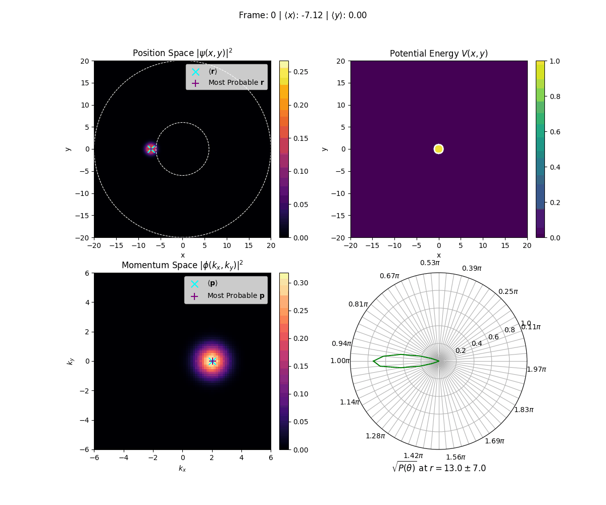

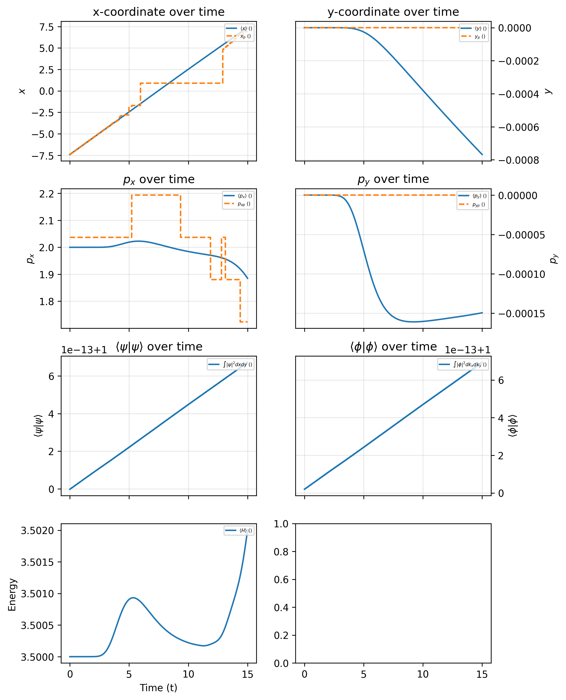

With a smaller $R$, less of the probability mass is directly reflected back, and surprisingly, less probability mass is directly transmitted. Rather, it seems that wave is converted into 2 waves going travelling diagonally to the right, which then interfere when they spread. The shape of the $P(\theta)$ plot after the encounter with the disk is also different, with the central peak we previously saw missing. 

### $R=0.3$


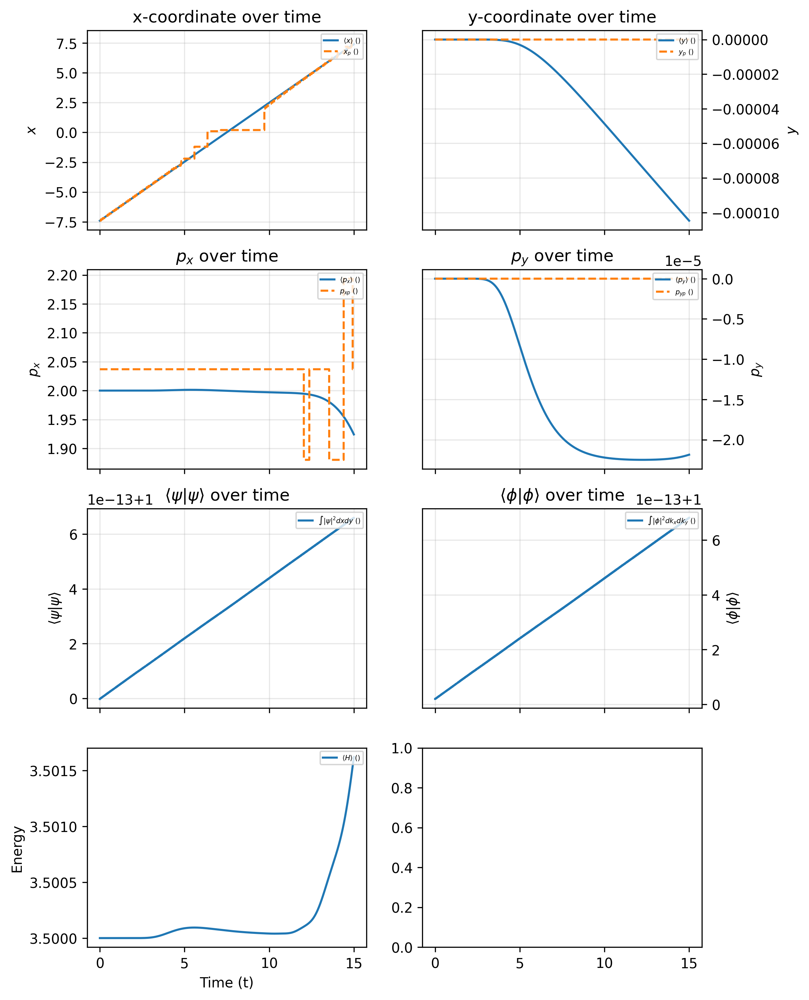

With an even smaller $R$, the shape of $P(\theta)$ after the encounter with the disk entirely changes to a more circular shape. Moreover, there is little to no change in the momentum wave-function before and after the encounter. Most likely the two diagonally travelling wavefronts we saw in the $R=1$ case are spreading more rapidly and interfering earlier in the shadow region. Thus, the probability mass in the shadow region isn't due to the transmitted wave, but rather interference of the deflected wavefronts.

### $k_x=5$

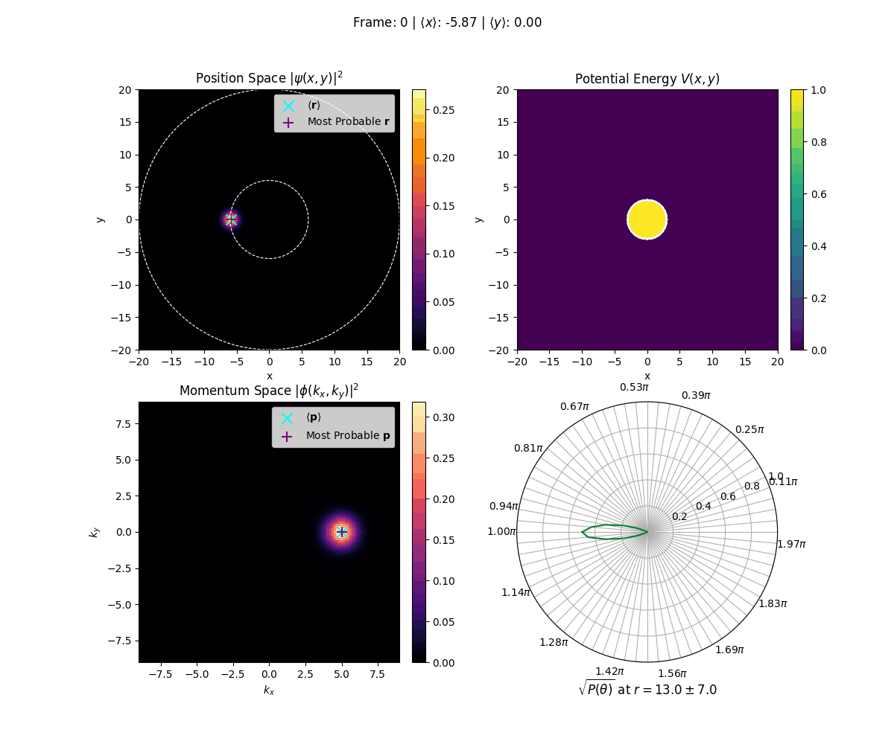

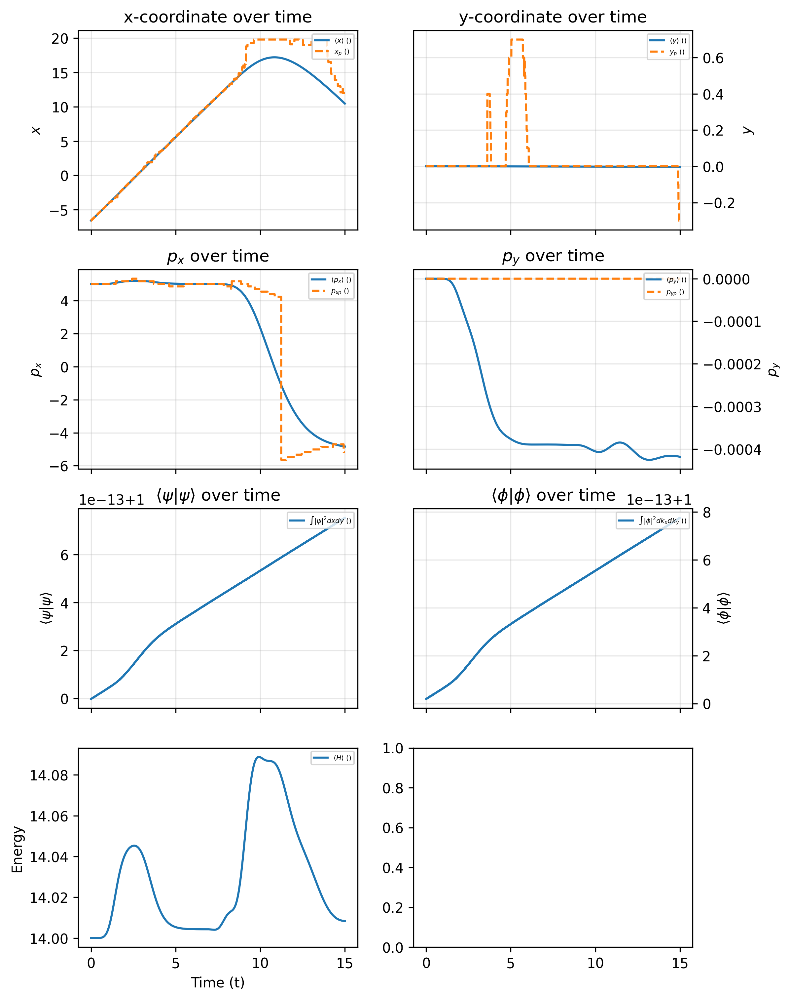

The interesting thing to notice is that when $k_x=5$, the particle entirely bypasses the repulsive disk. It is effectively going _over_ the disk, because it has a _much_ higher energy (around 13) than the potential of the disk (just 1). 

## Part (f): Attractive Potential

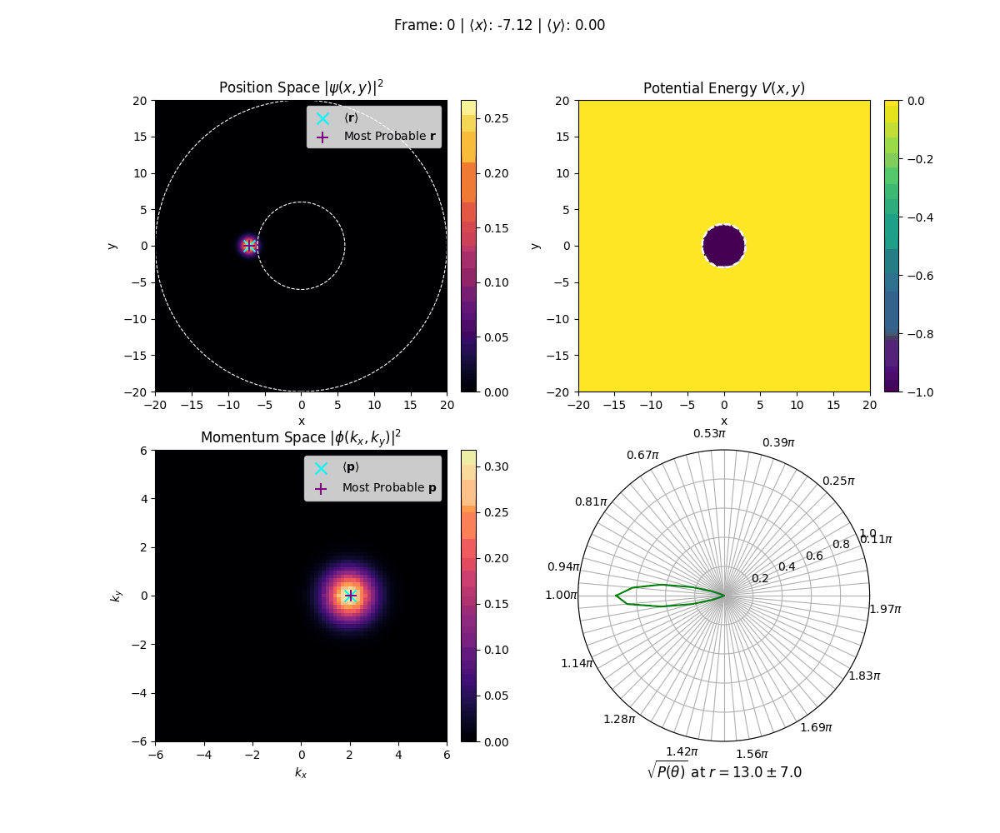

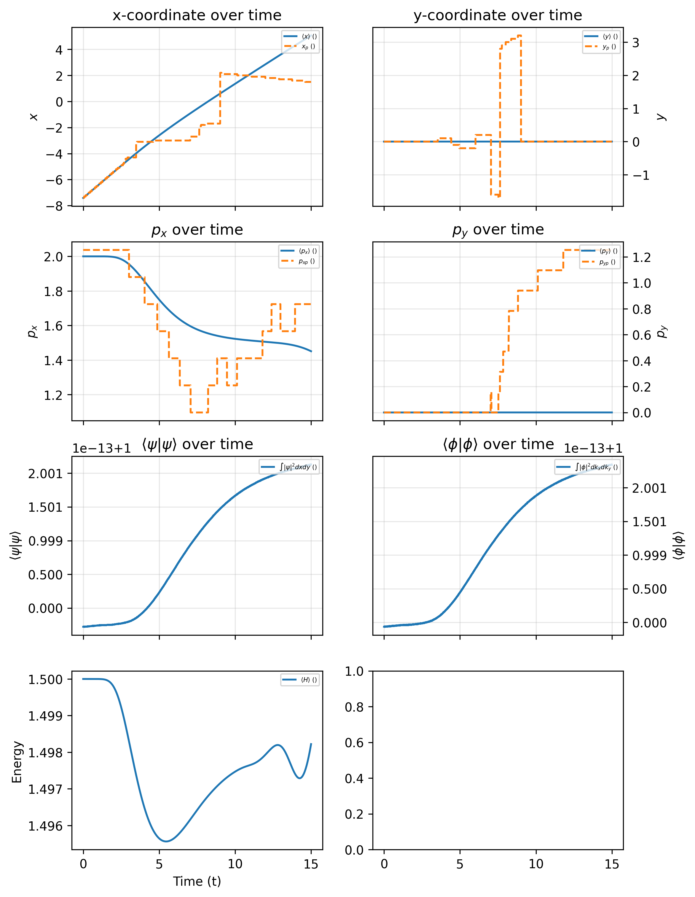

Unlike the repulsive potential where most of the probability mass is reflected back, for an attractive potential, most is transmitted through, although there is some that is reflected back. 
Similar to the decrease in momentum we saw when the particle entered the region with higher potential, here we see an _increase_ in the average momentum. 
Just like last time, at the end of the simulation, we start seeing the effect of the reflective boundary.

## Part (g): Convergence Tests

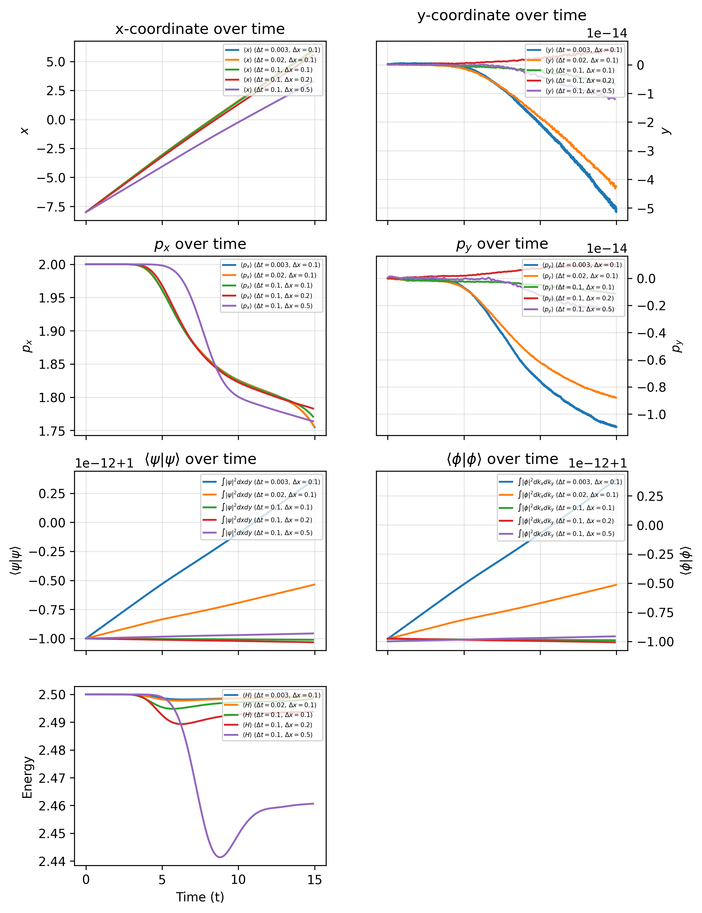

From the figure, we can gather than even after increaseing $\Delta t$ to 0.1 and increasing $\Delta x$ to 0.2, the numerical solution is accurate. 

Only when we increase $\Delta$ to 0.5 do we start getting inaccuracies. Even then, the general shape of the solution is the same. 